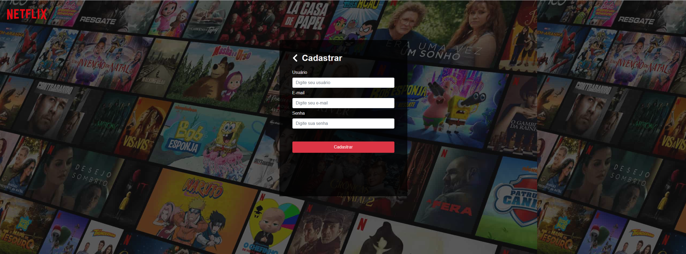
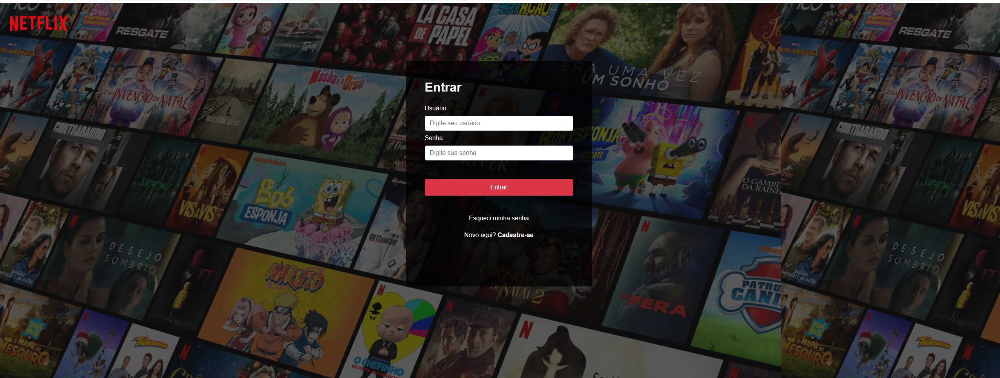
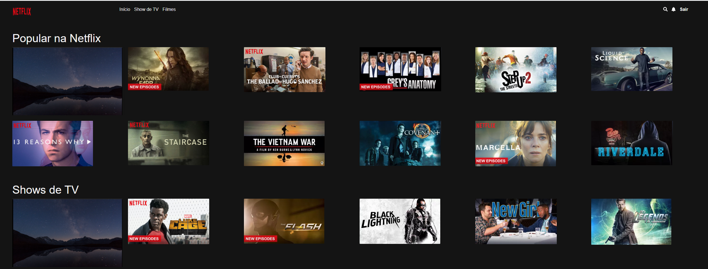
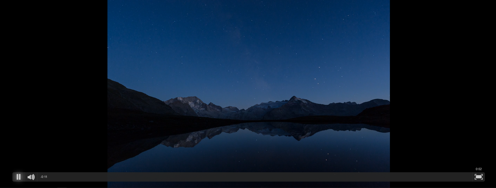

# Netflix Bandersnatch
Clone da netflix para treinar habildiades em java script nativo. A idéia inicial era trabalhar com a api Media Source do navegador, entregando vídeos sob demanda e armazenando em buffer. No fim deste README você pode ver as pendências desta funcionalidade que ficou incompleta.

## Setup
###Para rodar o projeto:

`npm install`: para instalar dependências

`npm run assets`: para iniciar o servidor que entregará arquivos estáticos

`npm run dev`: para rodar o servidor node.js na porta 8080

#### Caso tenha o docker instalado

`docker build -t netflix:latest .`

`docker run --name netflix-container -p 8080:80 -t netflix:latest`

caso tenha o docker-compose instalado basta executar o seguinte comando:`docker-compose up`

## Cadastro

## Login

## Lista de Títulos

## Vídeo

## TO-DO: VÍDEOS INTERATIVOS
A idéia inicial
- [x] Criação de script para renderizar os vídeos em diferentes resoluções
- [ ] Concluir a criação dos vídeos interativos, onde o usuário decide o destino do vídeo
- [ ] Concluir o armazenamento dos vídeos em buffer entregá-los de acordo com a velocidade da internet

### Créditos
- Projeto de estudo da Semana JS Expert realizada por [Erick Wendel] (https://www.instagram.com/erickwendel_/)
- Layout da lista de titulos foi baseada no  codepen do [Carlos Avila](https://codepen.io/cb2307/pen/XYxyeY)